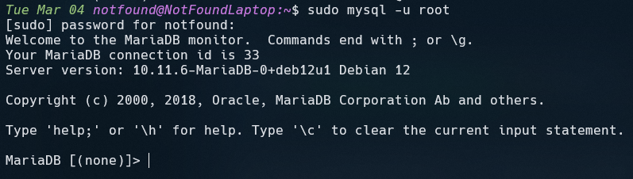

# Configuring MariaDB

## First Step

Let’s try to connect with `root`:

```bash
mysql -u root -p
```

<br/>

Normally, this command should return something like this:


<br/>

If you don’t know the password, don’t worry! We’ll create an AdminDB user for connecting, who will have full privileges to do everything with a single user!

## Creating the AdminDB

To create the `AdminDB` user, we need to be connected to our database service (here, we’ll use MariaDB, but this also works for MySQL!).

#### **Connecting to the database service:**

To connect without a password, we’ll use the `sudo` command:

```bash
sudo mysql -u root

# I’ve deliberately removed the -p option (for the password)
# since we won’t need it here
```

<br/>

This should display:


#### **Creating the AdminDB**

Once connected, we can create our user, which we’ll call _‘AdminDB’_ for this example:

> Of course, you can choose any name you like for the user, but make sure to remember it for later!

```SQL
CREATE USER AdminDB IDENTIFIED BY 'password'

# Feel free to replace 'password' with a password of your choice
```

<br/>
Once the user is created, we can grant them privileges.

#### **Granting Privileges**

To grant privileges to our user, we can run the following command:

```SQL
GRANT ALL PRIVILEGES ON *.* TO AdminDB IDENTIFIED BY 'password'

# Here, we’re giving all privileges on all tables to our user
```

---

Normally, everything should work if the procedure has been followed correctly.
