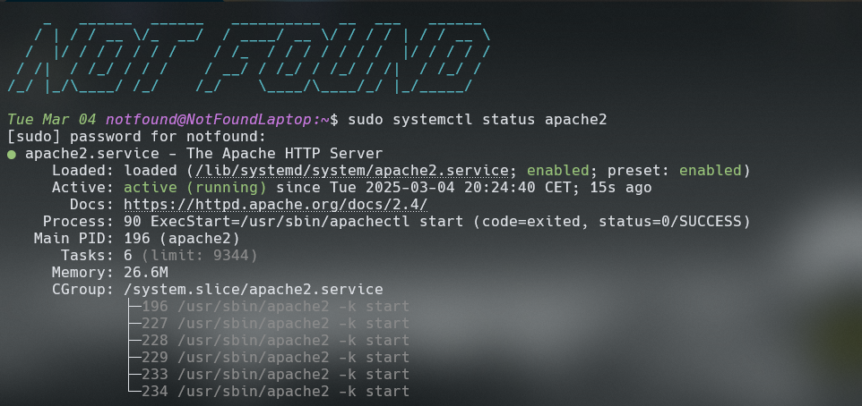
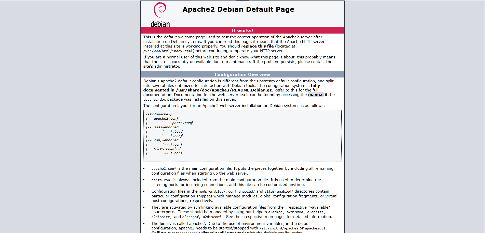
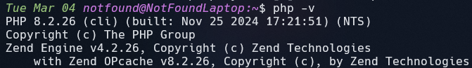
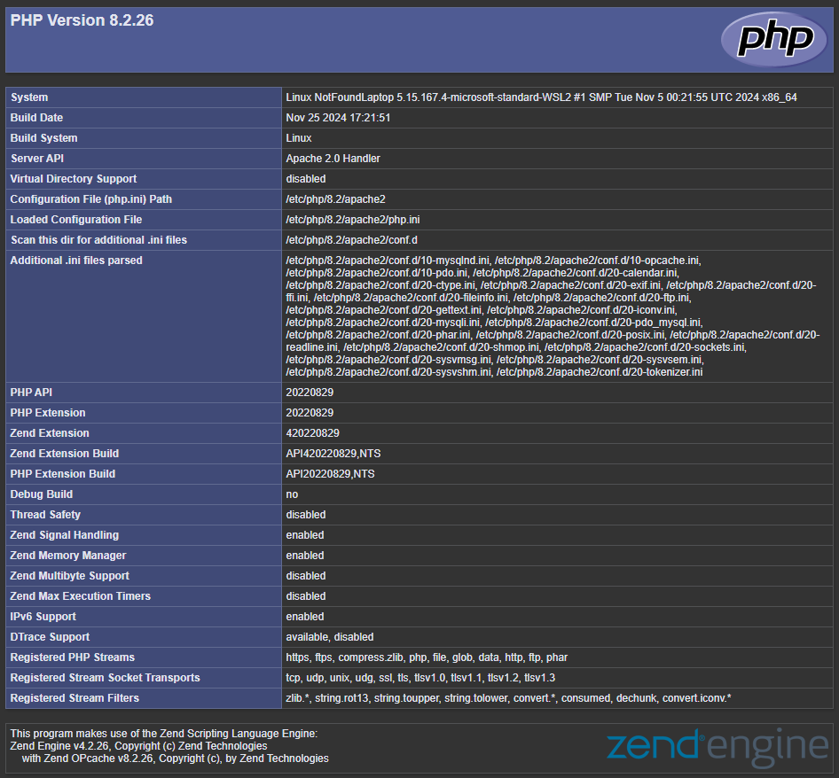

# Creating a LAMP Stack

**First, ensure you are on Linux or a WSL Linux environment**

If you are not on a Linux system, this repository is not intended for you.

---

## First, update your system

```bash
sudo apt update && sudo apt upgrade -y
```

<br/>
Once the system is updated, we can begin installing the necessary dependencies.

## Installing Apache 2

```bash
sudo apt install -y apache2 apache2-utils
```

<br/>

By default, Apache2 starts automatically when the system boots.<br/>
To verify this, you can simply type:

```bash
sudo systemctl status apache2.service
```

<br/>

If Apache has been installed correctly, this should display something like this:


<br>

If you have access to a graphical interface, you can simply search for _`localhost`_ in your browser’s search bar, and you should see this page:


## Installing MariaDB / MySQL

Once Apache is installed, we can move on to the database part before installing PHP.

### Installing MariaDB

```bash
sudo apt install -y mariadb-server mariadb-client
```

<br/>
Once the installation is complete, you can configure your database, create users, etc.

> PS: If you haven’t created a user yet, I explain everything in `./Config_MariaDB.md` about how to create an AdminDB. This will work for both MariaDB and MySQL.

### Installing MySQL

```bash
sudo apt install -y mysql-server
```

---

## Installing PHP

```bash
sudo apt install php libapache2-mod-php php-mysql
```

<br/>

This command will install **PHP** in its entirety, with the correct drivers, the right settings, etc.

### Checking the PHP version

> To avoid any permission issues when editing files in the following steps, I recommend running this command:

```bash
chown username /var/www/html/*
```

This will grant ownership permissions to the /var/www/html directory and all the files within it.

<br/>

**Via the terminal**

```bash
php -v
# should print php 8.2.26
```

Example:


<br/>

**Via Apache**

```bash
cd /var/www/html
```

<br/>

Once in the directory, edit the HTML file, or delete it with:

```bash
sudo rm index.html
```

<br/>

Then create a file called `index.php` in which you can add `phpinfo()`. This should display all the information about the PHP installed on your machine.

Example:


---

If you’ve made it this far, you’ve completed the installation of your LAMP stack, as well as the basic configuration. For more advanced configuration, I redirect you to the internet, where you’ll find more detailed explanations than what’s provided here.

---

# Notes:

> <br/>
> This repository is not perfect; it serves as a guide for a very minimal LAMP server installation. You’ll find more complete configurations on GitHub or elsewhere on the internet! 
> <br/>
> <br/>
> Thank you ! 
> <br/>
> <br/>
