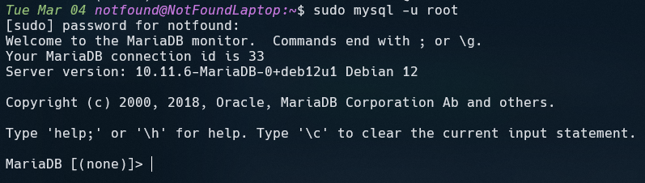

# Configuration de MariaDB

## Dans un premier temps

Essayons de nous connecter avec `root`

```bash
mysql -u root -p
```

<br/>

Logiquement cette commande devrais vous retourner ceci :


<br/>

Si vous ne connaissez pas le mot de passe, pas d'inquiétude ! Nous allons créer un utilisateur AdminDB pour la connexion, il possèderas tout les droits afin de pouvoir tout faire avec le même utilisateur !

## Création de l'AdminDB

Pour créer l'utilisateur `AdminDB` nous devons être connecter à notre service de base de donnée (Ici nous allons être sur MariaDB, cela marche également sur MySQL ! )

#### **Connexion au service de base de donnée :**

Pour ce connecter sans mot de passe, nous allons passer par la commande `sudo`

```bash
sudo mysql -u root

# J'ai vonlontairement retirer l'option -p (pour le mot de passe)
# étant donner qu'ici, nous n'allons pas en avoir besoin
```

<br/>

Cela devrais vous afficher :



#### **Création de l'AdminDB**

Une fois connecter nous allons pouvoir créer notre utilisateur que nous allons appeller _'AdminDB'_ pour l'exemple

> Vous pouvez bien sûr choisir le nom de votre choix pour l'utilisateur, mais attention à bien s'en rappeler par la suite !

```SQL
CREATE USER AdminDB IDENTIFIED BY 'password'

# A votre guise de remplacer le 'password' par le mot de passe de votre choix
```

<br/>
Une fois l'utilisateur créer nous pouvons lui accorder des droits.

#### **Accréditation des droits**

Pour accrédites des droits à notre utilisateur nous allons pouvoir taper la commande suivante :

```SQL
GRANT ALL PRIVILEGES ON *.* TO AdminDB IDENTIFIED BY 'password'

# Ici nous mettons tous les droit sur toutes les tables à notre utilisateur
```

---

Logiquement, tout devrais être fonctionnel si la procédure à été suivie.
