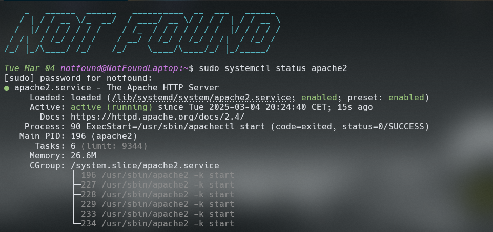
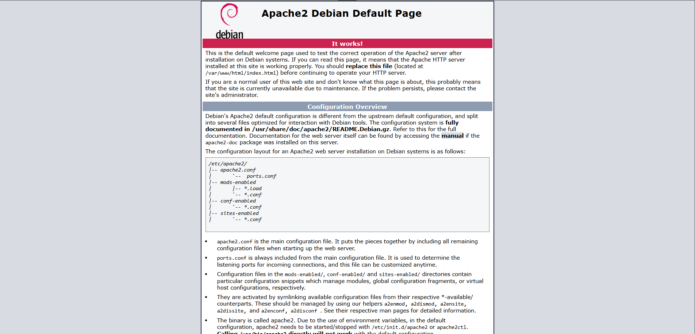
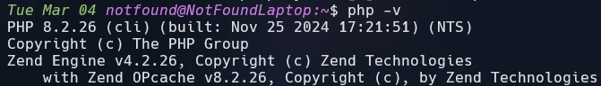
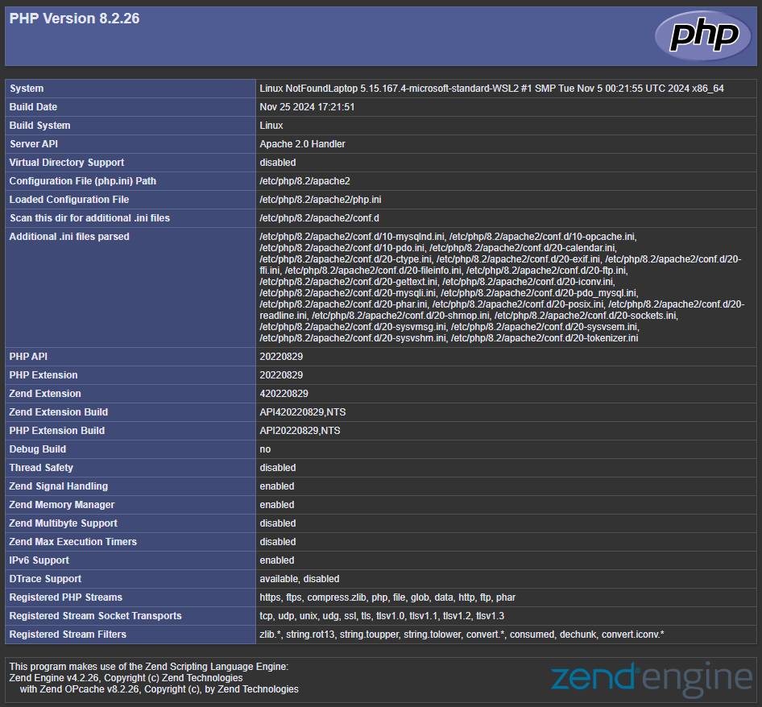

# Installation d'un serveur LAMP 🚀

[](./English-version/English_version.md)

## Prérequis

> ========================================
>
> ⚠️ **Important** : Cette documentation est destinée uniquement aux systèmes Linux ou WSL Linux.
>
> ========================================

## Table des matières

- [Mise à jour du système](#mise-à-jour-du-système)
- [Installation d'Apache 2](#installation-dapache-2)
- [Installation de la base de données](#installation-de-la-base-de-données)
- [Installation de PHP](#installation-de-php)
- [Notes](#notes)

## Mise à jour du système

Avant de commencer, mettez à jour votre système :

```bash
sudo apt update && sudo apt upgrade -y
```

## Installation d'Apache 2

1. Installation des paquets :

```bash
sudo apt install -y apache2 apache2-utils
```

2. Vérification du statut :

```bash
sudo systemctl status apache2.service
```

Résultat attendu :


> ---
>
> 💡 Si vous avez une interface graphique, ouvrez `localhost` dans votre navigateur :
>
> 
>
> ---

## Installation de la base de données

### Option 1 : MariaDB

```bash
sudo apt install -y mariadb-server mariadb-client
```

#### Sécurisation de MariaDB

1. Lancez le script de sécurisation :

```bash
sudo mysql_secure_installation
```

2. Suivez les étapes suivantes :
   - Appuyez sur Entrée pour le mot de passe root (par défaut vide)
   - Tapez 'Y' pour définir un mot de passe root
   - Entrez et confirmez votre nouveau mot de passe
   - Répondez 'Y' aux questions suivantes :
     - Supprimer les utilisateurs anonymes ? (Y)
     - Interdire la connexion root à distance ? (Y)
     - Supprimer la base de test ? (Y)
     - Recharger les privilèges ? (Y)

Exemple de sortie attendue :

```bash
Securing the MySQL server deployment.

Enter password for user root:
New password:
Re-enter new password:

Remove anonymous users? [Y/n] Y
Disallow root login remotely? [Y/n] Y
Remove test database and access to it? [Y/n] Y
Reload privilege tables now? [Y/n] Y

All done!
```

> 📝 Pour la configuration détaillée de MariaDB, consultez [MariaDB_Config.md](./MariaDB_Config.md)

### Option 2 : MySQL

```bash
sudo apt install -y mysql-server
```

#### Sécurisation de MySQL

1. Lancez le script de sécurisation :

```bash
sudo mysql_secure_installation
```

2. Suivez les étapes de configuration :
   - Configurez le plugin de validation du mot de passe
     - Choisissez le niveau de complexité (0 = LOW, 2 = STRONG)
   - Définissez un mot de passe root
   - Répondez 'Y' aux questions suivantes :
     - Supprimer les utilisateurs anonymes ? (Y)
     - Interdire la connexion root à distance ? (Y)
     - Supprimer la base de test ? (Y)
     - Recharger les privilèges ? (Y)

Exemple de sortie attendue :

```bash
Securing the MySQL installation.

Validating password strength for root user.
Press y|Y for Yes, any other key for No: Y

Choose the level of password validation policy:
0 = LOW    Length >= 8
1 = MEDIUM Length >= 8, numeric, mixed case, and special characters
2 = STRONG Length >= 8, numeric, mixed case, special characters and dictionary
Please enter 0 = LOW, 1 = MEDIUM and 2 = STRONG: 1

Remove anonymous users? [Y/n] Y
Disallow root login remotely? [Y/n] Y
Remove test database and access to it? [Y/n] Y
Reload privilege tables now? [Y/n] Y

All done!
```

> 📝 Pour la configuration détaillée de MySQL, consultez la [Documentation MySQL](https://dev.mysql.com/doc/)

## Installation de PHP

1. Installation des paquets PHP :

```bash
sudo apt install php libapache2-mod-php php-mysql
```

2. Configuration des permissions :

```bash
sudo chown $USER /var/www/html/*
```

### Vérification de l'installation

#### Via Terminal

```bash
php -v  # Devrait afficher PHP 8.2.26
```



#### Via Apache

1. Accédez au répertoire web :

```bash
cd /var/www/html
```

2. Supprimez l'index par défaut :

```bash
sudo rm index.html
```

3. Créez un fichier `index.php` avec le contenu suivant :

```php
<?php phpinfo(); ?>
```

Résultat attendu :


## Notes

> ⚠️ **Avertissement** : Cette configuration est destinée à un environnement de développement local ou un réseau fermé.
> Ne pas utiliser en production sans configuration de sécurité supplémentaire.

---

💡 **Conseil** : Pour une configuration plus approfondie, consultez la documentation officielle de chaque composant :

- [Apache Documentation](https://httpd.apache.org/docs/)
- [PHP Documentation](https://www.php.net/docs.php)
- [MariaDB Documentation](https://mariadb.org/documentation/)

---

_Si vous trouvez ce guide utile, n'hésitez pas à le partager !_ ⭐
