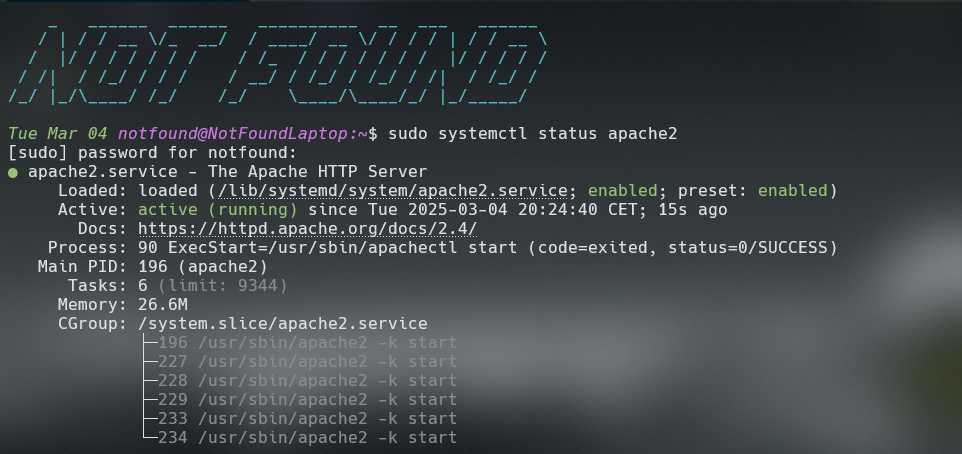
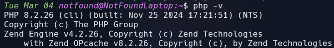
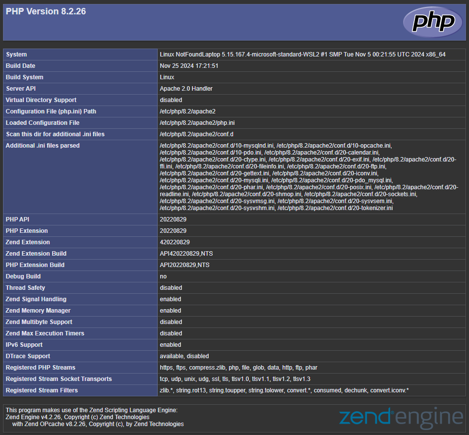

# An English version is available here :

**[English Version](./English-version/English_version.md)**

---

# Création d'un LAMP

**Tout d'abord assurez vous d'être sur Linux ou une WSL Linux**

Si vous n'êtes pas sur un système Linux, ce repos ne s'adresse pas à vous.

---

## Dans un premier temps mettez à jour votre système

```bash
sudo apt install && sudo apt upgrade -y
```

<br/>
Une fois le système à jour nous pouvons commencer à installer les dépendance nécessaires.

## Installation d'Apache 2

```bash
sudo apt install -y apache2 apache2-utils
```

<br/>

Par défaut Apache2 se lance directement lors de la connexion sur le système.<br/>
Pour vérifier cela vous pouvez simplement tapper

```bash
sudo systemctl status apache2.service
```

<br/>

Si apache à bien été installer cela vous devrais vous afficher ceci :


<br>

Si vous avez accès à une interface graphique, vous pouvez simplement rechercher _`localhost`_ dans la barre de recherche de votre navigateur et vous devriez tomber sur cette page :


## Installation MariaDB / MySQL

Une fois Apache installer nous pouvons nous orienter sur la partie base de donnée avant d'installer le PHP.

### Installation de MariaDB

```bash
sudo apt install -y mariadb-server mariadb-client
```

<br/>
Une fois l'installation terminer, vous pouvez configurer votre base de donnée, créer des utilisateurs ect.

> PS : Si vous n'avez pas d'utilisateur de créer, j'explique tout dans la [Config MariaDB]("./MariaDB_Config.md") comment créer un AdminDB, cela sera valable pour MariaDB et MySQL

### Installation de MariaDB

```bash
sudo apt install -y mysql-server
```

---

## Installation PHP

```bash
sudo apt install php libapache2-mod-php php-mysql
```

<br/>

Cette commande vous permettra d'installer **PHP** dans toute ça globalité, avec les bons drivers, les bon paramètres...

### Vérifier la version de PHP

> Pour éviter tout soucis de permission pour l'édition des fichiers dans la suite des commandes, je vous conseil de taper la commande suivante :

```bash
chown nomutilisateur /var/www/html/*
```

Ceci donnera les accès propriétaire pour le dossier /var/www/html ainsi que tout les fichier présent dans ce dernier.

<br/>

**Par le terminal**

```bash
php -v
# devrais print php 8.2.26
```

Exemple :


<br/>

**En passant pas Apache**

```bash
cd /var/www/html
```

<br/>

Une fois dans le dossier, éditer le fichier HTML, ou supprimer le avec

```bash
sudo rm index.html
```

<br/>

Ensuite créer un fichier `index.php` dans le quel vous pouvez mettre `phpinfo()`, ceci devrais vous afficher l'entiertée des informations de PHP installer sur votre machine.

Exemple :


---

Si vous êtes arrivez ici, c'est que vous avez terminer l'installation de votre LAMP, ainsi que la base de la configuration, pour la configuration plus poussée, je vous redirige vers internet, ou vous trouverez de plus ample explications que ce que vous pouvez trouvez ici.

---

# Notes :

> <br/>
> Ce repos n'est pas parfait, il fait guise de guide pour une installation vraiment minimal d'un serveur LAMP, vous trouverez des configurations plus complète sur github ou même internet ! 
> <br/>
> <br/>
> Merci à vous ! 
> <br/>
> <br/>
